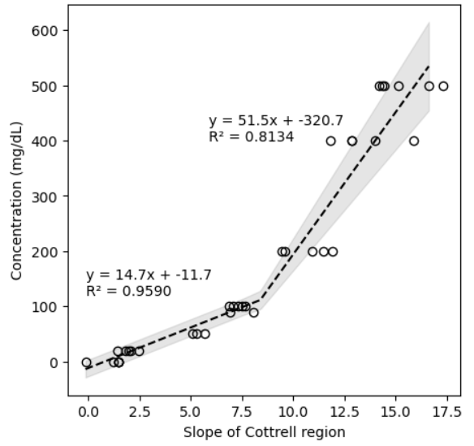
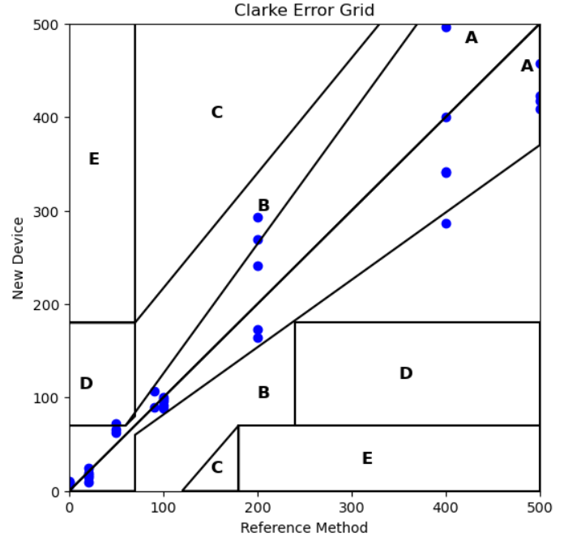

<link rel="stylesheet" href="style.css">

# Glucometer Project Home
 
[Home](#home) | [Proposal](#proposal) | [Current Work](#work) | [Code](#code) | [About Me](#me)

  <h2>Home</h2>
  
Welcome! Overview of project will go here...

  
This GitHub page will be used to store my work for a group <a href="https://bpaulina25.github.io/CBE3300B/">  glucometer project </a>.

  
Until then, click around to learn more about what I'm working on!

  <h2>Proposal</h2>
  
<b>Under construction</b>

  <h2>Current Work</h2>
  
We are comparing our glucometer with the AimStrip Plus. This meter, like all glucometers, is calibrated to whole blood. Since we are
  comparing our device to the AimStrip Plus as a reference, we need to find a way to convert our calibration to glucose in PBS (simulates
   plasma) to glucose concentrations in whole blood.
  

  <h2>Potentiostat Code Development</h2>

  
We are using the <a href="https://iorodeo.com/products/rodeostat" target="_blank">IO Rodeo Rodeostat</a> as our potentiostat circuit base.

  <h3>How to Set Up the IO Rodeostat</h3>
  <ul>
    <li>Download <code>potentiostat.py</code> from the IO Rodeo GitHub (version 0.0.9)</li>
    <li>Follow the setup instructions in the <a href="https://iorodeo.github.io/iorodeo-potentiostat-docs-build/installation.html" target="_blank">Installation Guide</a></li>
    <li>Customize your code and begin testing!</li>
  </ul>

  <h3>Relevant Code Files</h3>
  <ul>
    <li>
      <a href="MVP Codes/milestone 4 code.py" target="_blank">MVP Rodeostat-Arduino Code</a>: This script runs the Rodeostat and calibration with UI compatibility
      for the Arduino GIGA R1. <b>Key features:</b> Serial port auto-detection, chronoamperometry execution,
      signal processing, Arduino communication, and data logging.
    </li>
    <li>
      <a href="MVP Codes/glucometer GUI.py" target="_blank">Glucometer GUI Script</a>: Standalone Python GUI for users without Arduino display.
      <b>Key features:</b> Simple button interface, daily average calculation, threaded execution for responsiveness.
    </li>
    <li>
      <a href="MVP Codes/glucometer.py" target="_blank">Glucometer Core Functions</a>: Core logic supporting both Arduino and GUI workflows.
      <b>Key features:</b> Modular architecture, signal processing, Excel/CSV logging, and error handling.
    </li>
  </ul>

  <h3>Methodology</h3>
  <ol>
    <li>
      Apply a 200 mV constant potential step after a 6-second quiet time to allow glucose oxidation on the test strip.
      <ul>
        <li>Optimal quiet time and step potential experimentally validated.</li>
      </ul>
    </li>
    <li>Run the chronoamperometry test for 1 second.</li>
    <li>
      Perform linear regression of current vs 1/√t and convert the slope to glucose concentration.
      <ul>
        <li>Optimal window for linear regression experimentally validated.</li>
      </ul>
    </li>
  </ol>

  <h3>Calibration</h3>
  

  <h3>Clarke Error Grid</h3>
  

  <h3>Data Analysis Pseudocode</h3>
  <ol>
    <li>
      Load raw chronoamperometry data from Excel/CSV into a DataFrame.
      <ul>
        <li>Extract time, voltage, and current traces.</li>
        <li>Filter current data once the step is applied.</li>
      </ul>
    </li>
    <li>
      Confirm if Cottrell behavior appears (diffusion-limited regime).
      <ul>
        <li>Slide a regression window over current vs 1/√t.</li>
        <li>Identify the region with highest R².</li>
      </ul>
    </li>
    <li>
      Extract Cottrell region and fit a linear regression to calculate slope.
    </li>
    <li>
      Choose a calibration model.
      <ul>
        <li>Compare linear vs polynomial models.</li>
        <li>Try a piecewise model to separate low vs high glucose regimes.</li>
      </ul>
    </li>
    <li>
      Validate performance using the Clarke Error Grid for diagnostic accuracy.
    </li>
  </ol>

  <h2>About Me</h2>
  
  
 Hi I'm Kayla! (That's me on the right.) 

  
 I am a chemical engineer currently studying at UPenn. In my free time I like to do crosswords, bar trivia, cook, beat my friends at tennis, visit museums, and design glucometers. 

  

    <strong>Contact me:</strong> 
    <a href="mailto:kmpowell@seas.upenn.edu">kmpowell@seas.upenn.edu</a>
  

